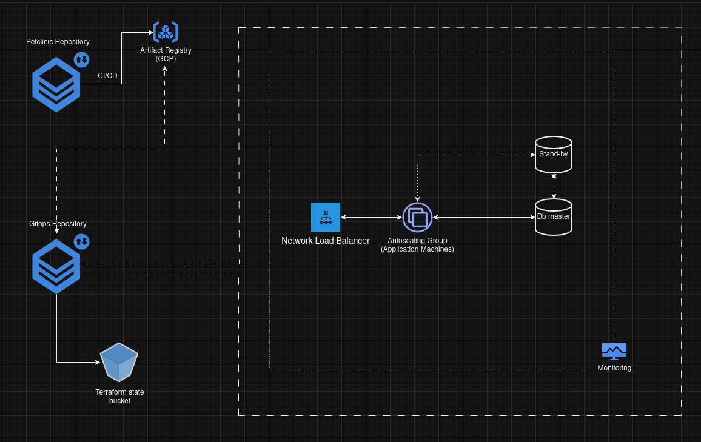

# Welcome to my DevOps showcase project!

Hi, my name is Jakub Antkiewicz and I've created this repository to show my skills as a devops.

As an application, I'm using [forked-Petclinic](https://github.com/Jakub-A-DO/spring-petclinic-devops), which is fork of popular java application [petclinic](https://github.com/spring-projects/spring-petclinic).

Project consists of 2 repositories:

- App repository (linked above)
- Infra, gitops repository (this one)

## App repository

Things I've added or changed:

- Job with unit and integration tests + SonarQube (static code analysis)
- Job with image built using "spring-boot:build-image", which is pushed to artifact repository on GCP, using OIDC to authenticate. Image is then scanned using Trivy to find potencial vulnerabilities.

## Infrastructure repository

- Terraform plan on pull request creation (with plan added as comment)
- Terraform apply on merge
- Ansible run on merge

## Infrastructure

### APP

- Autoscaling group, provisioned with startup-script.sh (3-6 servers in different zones)
- Containers are auto-updated using [watchtower](https://github.com/containrrr/watchtower)
- autohealing enabled (based on healthchecks)
- Load balancer before app servers
- App installed using docker compose
- Promtail, Cadvisor and node-exporter installed

### DB

- Master-standby Postgres configuration
- Provisioned with ansible
- Scheduled backups to object storage
- Started using docker-compose
- Promtail, Cadvisor and node-exporter installed

### Monitoring

- Grafana, Prometheus and Loki stack
- Promtail, Cadvisor and node-exporter
- Provisioned with ansible
- Single node
- Dynamic servers discovery using gce_sd_configs
- Grafana preconfigured with datasources and dashboards

## Architecture diagram

Click to expand

### Simple arch diagram to show system design (details ommited, they are described in code)

## Used GCP resources

Click to expand

- Computer instances
- Computer firewall
- Compute region autoscaller
- instance template
- region compute instance group manager
- backend service
- health checks
- global address
- url map
- target http proxy
- global forwarding rules
- artifact registry
- service accounts
- storage bucket
- workloads

## Things to add/improve

Click to expand

- alerts in grafana (or alert manager)
- bastion host for access to private network for ansible, would limit public access and public ip wouldn't be needed for some resources
- separated environments (dev, test, prod) - optional

## Things ommited by purpose

Click to expand

- db failover, quite complicated and can be resolved using gcp managed service (didn't use it because of cost)
- db backups - quite trivial - cron or systemd service with timer + upload to db (would be also resolved with Cloud SQL)
- monitoring in ha - simple solution would be to add another instances of grafana (stateless) and multiple instances of prometheus. Data would be duplicated, but server/service failure won't cause DOS. This problem is much better resolved on K8s.
  Also public ips are limited to 8 per region for trial account - could be solved by add bastion server as jump proxy for ansible.
- using default vpc - it's enough for this project
- single env - currently enough
- ssl - not needed for this project

